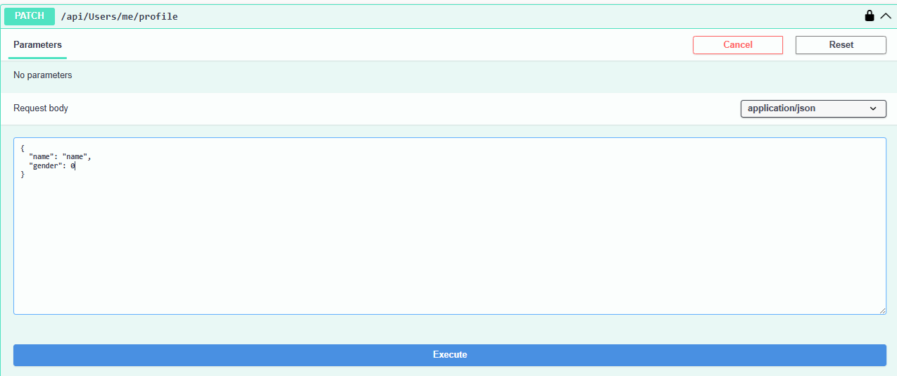

# ITTP Тестовое задание

## Основные технологии

- .NET 9 (ASP.NET Core)
- Entity Framework Core (PostgreSQL)
- JWT-аутентификация (Bearer Token)
- MediatR (CQRS-паттерн)
- Swagger UI (Документация API)
- Clean Architecture

## Примеры запросов созданных по заданию (Swagger)

### 1. Регистрация нового пользователя


### Вход в систему


### 2. Изменение имени, пола или даты рождения



### 3. Изменение пароля


### 4. Изменение логина


### 5. Запрос всех активных пользователей


### 6. Запрос пользователя по логину


### 7. Запрос пользователя по лоигну и паролю


### 8. Запрос всех пользователей старше определенного возраста

-Старше 10


-Старше 14


### 9. Удаление пользователя

-Полное


-Мягкое


### 10. Восстановление пользователя


## База данных (PostgresSQL + EF Core)

### Сущности:

  - User
  - Role

### Миграция: 

```bash
dotnet ef migrations add InitialMigration --project ITTPEx.Infrastructure --startup-project ITTPEx.API
dotnet ef database update --project ITTPEx.Infrastructure --startup-project ITTPEx.API
```

